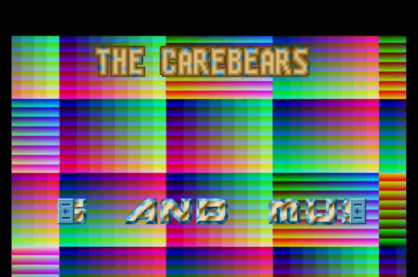
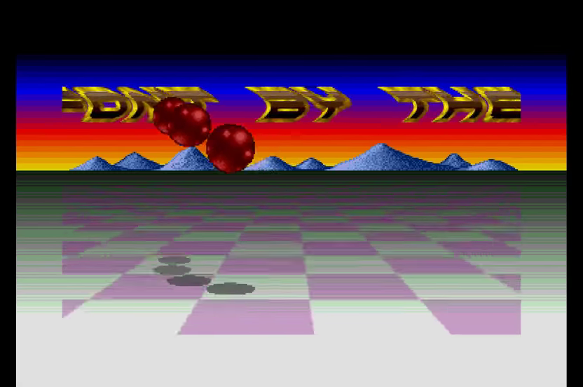
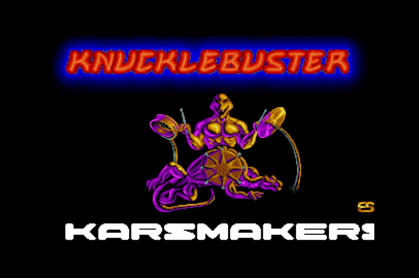
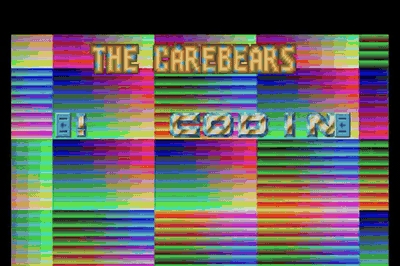

# Cuddly Demos in Go

Native Go/Ebitengine implementation with YM playback and embedded artwork,
fonts and audio. Desktop and Android share the same rendering and input code.

<!-- Project showcase -->
## Screenshots

[](docs/media/screenshot-1.png)

Rainbow raster patterns and scrolling text.

[](docs/media/screenshot-2.png)

Bouncing red balls over a perspective checkerboard.

[](docs/media/screenshot-3.png)

Music-synchronized drummer and scrolling text.

## Video

[](https://github.com/olivierh59500/go-cuddlymenu/raw/refs/heads/main/docs/media/preview.mp4)

**[Watch or download the 24-second MP4 preview with sound](https://github.com/olivierh59500/go-cuddlymenu/raw/refs/heads/main/docs/media/preview.mp4)**

This short showcase combines selected passages from the Go production.

The animated image is silent; the MP4 includes the soundtrack.

<!-- End project showcase -->

## Production notes

```sh
go run ./dck/cmd/cuddlydemo   # Complete production, starting with the intro.
go run ./dck/cmd/cuddlymenu   # Start directly in the menu.
go run ./cmd/cuddlymenu       # Original standalone Go menu.
```

The complete version contains the introduction, menu, thirteen demo screens and
Reset. Loading transitions include artwork, counters, scrolling text and audio.

Playback defaults to 60 fixed updates per second. Use F3, `-hz 50`, or the mobile
rate button to compare animation speeds. Music retains its normal sample clock.
F1 selects a screen; Space/Escape returns to the menu; R opens Reset.

Build and install the complete Android application on one authorized USB device:

```sh
./scripts/run-cuddlydemo-android.sh
```

The app is **Cuddly Demo (DCK)** (`com.olivierh.cuddlydemo`). Its touch controls
provide movement/thrust, ENTER, MENU, RESET, SCREENS, the rate selector and a
CRT OFF / CRT ON button in the menu.
The original standalone Android menu uses `./scripts/run-android.sh`.

Knucklebuster's drummer follows the original Atari music routine rather than
random triggers. Its two arms, bass drum and head have independent animation
channels, with six-tick drum gestures and a twenty-tick head hold. DCK samples
the complete 50 Hz animation bank at audible music progress, preserving the
rhythm at either display rate. The 54,750-frame bank spans the full 1,095-second
soundtrack and is verified against 219,000 original 68000 animation flags.

See [the native DCK entry points](dck/README.md) for screen selection, asset layout
and validation commands. Go downloads the published DCK module pinned in
`go.mod` and its audio dependencies automatically. Every DCK entry point uses
`sound.Open(filename, data, options)`: decoder selection, metadata, PCM conversion
and looping are handled by DCK for YM, WAV and MP3 soundtracks. The standalone
DCK menu shares this same entry point.
